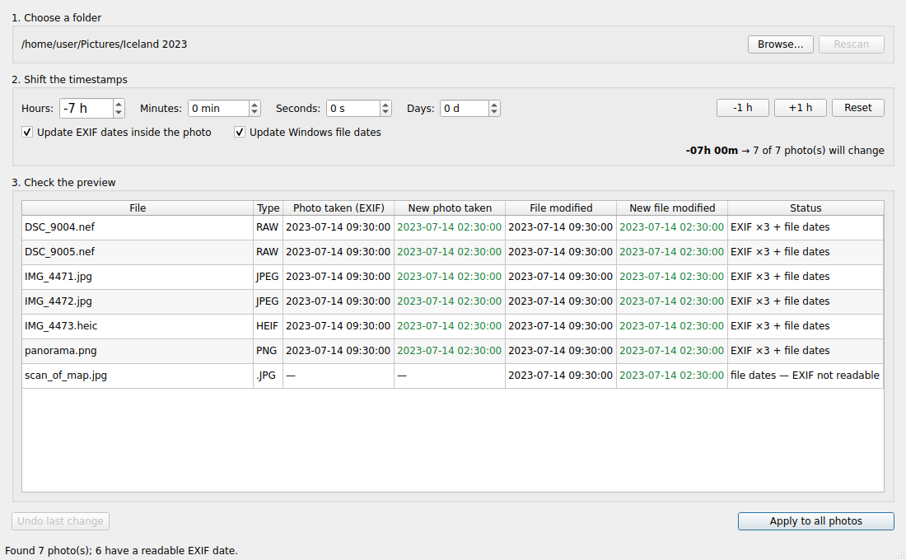

# Photo Timestamp Editor

A small Windows desktop app for fixing the dates on a whole folder of photos at
once — most often because the camera was set to the wrong time zone.

Pick a folder, dial in a shift (`-7 h`, `+1 h`, whatever you need), check the
preview table, and apply. Every change can be undone.



## What it does

* **Shifts by hours** (plus minutes, seconds and days) — positive or negative.
* **Updates the EXIF dates inside each photo**: `DateTimeOriginal`,
  `DateTimeDigitized` and `DateTime`. These are what Windows Photos, Lightroom,
  Google Photos and Apple Photos sort by.
* **Updates the Windows file dates** — modified, accessed, and created.
* **Previews everything first** so you can see the old and new values per file
  before anything is written.
* **Undoes the last change**, restoring the exact original bytes and file dates.

## Your files are never rewritten

EXIF date values are fixed-width ASCII (`YYYY:MM:DD HH:MM:SS`), so a shifted
date is always exactly as long as the one it replaces. The app takes advantage
of that: it seeks to the date characters and overwrites them where they sit.

* No file is ever copied, moved, replaced, or deleted.
* No image is re-encoded, so there is no quality loss — not even for JPEG.
* File sizes never change, and no byte outside the date fields is touched.
* Before writing, the app re-checks that each target still holds the bytes it
  saw during the scan. If anything has changed, that file is skipped and
  nothing is written to it.
* If one file fails, the rest still go through, and the failed one is rolled
  back rather than left half-changed.

This is also why raw and HEIC files are fully supported rather than limited to
file dates — there is no re-encoding step to worry about.

## Supported formats

| Format | EXIF dates | File dates |
| --- | --- | --- |
| JPEG (`.jpg`, `.jpeg`, `.jpe`) | yes | yes |
| HEIC / HEIF (`.heic`, `.heif`, `.hif`) | yes | yes |
| TIFF (`.tif`, `.tiff`) | yes | yes |
| Raw (`.cr2`, `.nef`, `.arw`, `.dng`, `.orf`, `.rw2`, `.pef`, `.srw`, `.raf`) | yes | yes |
| PNG (`.png`) | yes, if it has an `eXIf` chunk | yes |

Files with no readable EXIF still get their file dates shifted; the preview
table says so per file.

## Getting it onto a Windows PC

### The portable build (what most people want)

Extract the ZIP anywhere and double-click `PhotoTimestampEditor.exe`. There is
no installer, no Python, and no download on first run.

* Opens in about a second — the folder build doesn't unpack itself to a temp
  directory the way a single-file `.exe` does.
* Fully portable: settings and undo history go in the `data` folder next to the
  program, not into your user profile or the registry. Run it from a USB stick
  and delete the folder afterwards; nothing is left behind.
* Extract the folder *before* running it. Double-clicking the `.exe` from
  inside the ZIP only unpacks part of it and the program won't start.

The first launch shows **"Windows protected your PC"**. That box appears for
any program without a paid code-signing certificate — click **More info →
Run anyway**. It should only ask once.

### Building the ZIP on GitHub (no Windows machine needed)

The **Build Windows portable** workflow builds on a Windows runner.

* **To test a build:** Actions tab → *Build Windows portable* → **Run
  workflow**. The ZIP is attached to the run as an artifact; nothing is
  published.
* **To publish a release, from the browser:** Releases → *Draft a new release*
  → **Choose a tag** → type `v1.0.2` → *Create new tag on publish* →
  **Publish release**. The build starts and attaches the ZIP to that release a
  few minutes later. No local clone needed.
* **To publish a release, from a clone:** push the tag and the workflow creates
  the release itself.

  ```
  git tag v1.0.2 && git push origin v1.0.2
  ```

Either way the tag must match `__version__` in
`photo_timestamp_editor/__init__.py` — the ZIP is named from the version, so a
mismatch would produce a download URL that disagrees with the tag. The workflow
checks this and stops before publishing rather than shipping something
inconsistent.

Release notes come from `packaging/release-notes.md`, but only when the
workflow creates the release itself; notes written by hand in the web UI are
left alone.

The download URL is then predictable:

```
https://github.com/<owner>/<repo>/releases/download/v1.0.2/PhotoTimestampEditor-1.0.2-windows-x64.zip
```

### Building the ZIP locally

You need [Python 3.10 or newer](https://www.python.org/downloads/windows/) on
the machine doing the build (with "Add python.exe to PATH" ticked). Nobody you
give the ZIP to needs it.

Double-click **`build_windows.bat`**. It sets up an isolated build environment,
runs PyInstaller, checks the result actually starts, and leaves you with:

```
dist\PhotoTimestampEditor\                        the folder to run
dist\PhotoTimestampEditor-1.0.2-windows-x64.zip   the folder, zipped, to hand out
```

Both paths call `tools/package_portable.py` for the final step, so the ZIP is
named in exactly one place.

The build strips out everything Qt ships that a widgets app never touches —
QtWebEngine alone is 195 MB — which takes the bundle down from roughly 650 MB
to well under 100 MB on Windows.

### Running from source

For development, or if you'd rather not build. Double-click **`run.bat`**: it
creates a virtual environment, installs PySide6, and launches. The first run
takes a minute; later ones start immediately. By hand:

```
pip install -r requirements.txt
python -m photo_timestamp_editor
```

`requirements.txt` asks for `PySide6-Essentials` rather than the full `PySide6`
— same widgets, without the WebEngine/3D/multimedia payload this app has no use
for.

## How to use it

1. **Choose a folder.** Photos sitting directly in it are listed; subfolders are
   not included.
2. **Set the shift.** For a time-zone mistake, use the hours box — if the camera
   was five hours ahead, set `-5 h`. The `-1 h` / `+1 h` buttons are there for
   daylight-saving fixes.
3. **Check the preview.** The table shows each file's current and new dates, and
   what will be written to it.
4. **Apply.** You will be asked to confirm, then the shift is applied.
5. **Undo** if it wasn't what you wanted. The button restores the most recent
   change, exactly.

Undo logs are kept outside your photo folder, so nothing is ever added to the
folder you are working on. The last 50 are retained. They live in the `data`
folder next to the program in the portable build, and in
`%LOCALAPPDATA%\PhotoTimestampEditor` otherwise — deleting `portable.txt` from
the app folder switches it to the latter.

## Notes and limits

* EXIF dates carry no time zone, so a shift moves the recorded local time. If a
  file has the newer `OffsetTime` tags, they are left alone — worth knowing if
  you rely on them.
* Raw files sometimes keep a second copy of the capture time inside the
  manufacturer's private maker note. That copy is left untouched, since editing
  it safely is camera-specific. The standard EXIF tags that software reads are
  updated.
* The Windows **created** date can only be written on Windows. On other
  platforms the app still runs and shifts modified/accessed dates.
* Subfolders are not scanned.

If something goes wrong, the app writes to `data\logs\app.log` next to the
program (or `%LOCALAPPDATA%\PhotoTimestampEditor\logs\app.log` when not
portable). That is the first place to look when reporting a problem.

## Development

```
pip install -r requirements-dev.txt
python -m pytest
```

The tests build small synthetic JPEG, PNG, HEIF, TIFF and raw files byte by byte
and check that a shift lands on the right bytes, leaves every other byte alone,
keeps PNG chunk CRCs valid, and reverses exactly.

| Module | Role |
| --- | --- |
| `exif.py` | Finds and patches EXIF date tags. Standard library only. |
| `filetimes.py` | Reads and writes file dates, including Windows creation time. |
| `core.py` | Scans a folder, plans a shift, applies it, undoes it. |
| `undo_store.py` | Saves undo records between sessions. |
| `paths.py` | Decides where settings and undo logs go (portable or AppData). |
| `log.py` | Writes errors to a file, since a windowed build has no console. |
| `gui.py` | The PySide6 window. |

`packaging/` holds the PyInstaller spec and the text file shipped inside the
ZIP; `tools/make_icon.py` regenerates the app icon and is only needed if the
icon design changes.
